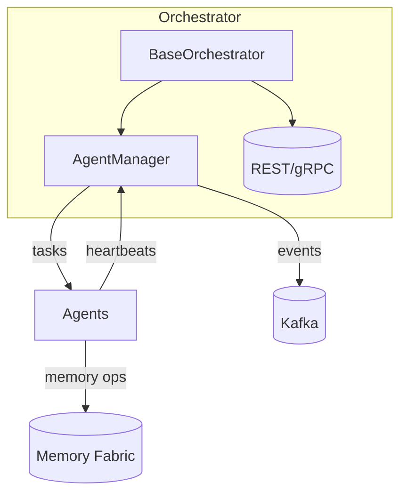

[See docs/DISCLAIMER_SNIPPET.md](../docs/DISCLAIMER_SNIPPET.md)

# Architecture Overview

This document gives a concise overview of the Alpha‑Factory stack.

The orchestrator instantiates an `AgentManager` which schedules agent cycles and
monitors their health. Optional REST and gRPC servers expose control endpoints.
Agents persist data through the Memory Fabric and may publish events to Kafka.

All components can run independently in development and are designed to fail
gracefully when optional dependencies (like Kafka or FastAPI) are missing.

## Key Components

- **BaseOrchestrator** – shared helper that starts/stops the servers and
  underlying `AgentManager`.
- **AgentManager** – maintains a collection of `AgentRunner` instances,
  coordinating their execution and heartbeats.
- **Memory Fabric** – pluggable storage combining vector and graph databases.
- **Telemetry** – Prometheus metrics exporting agent cycle latency and errors.
- *Placeholder logic* – `transfer_test.evaluate_agent` merely echoes the
  archived score. Future updates will evaluate agents on the selected model.
  `MetaRefinementAgent` also includes a very naive log parser that suggests
  increasing an agent's cycle period when cycles consistently exceed five
  seconds.

For more details see `docs/DESIGN.md` and the module docstrings within
`alpha_factory_v1/backend`.

## Agent lifecycle

Agents are instantiated synchronously so their constructors **must not** schedule
asynchronous tasks. The orchestrator invokes each agent's optional
`_register_mesh()` coroutine once the event loop is running, awaits the
`init_async()` hook for background setup and calls the `setup()` coroutine for
heavy initialisation. This allows agents to be created in standard blocking
code without errors about missing event loops.
